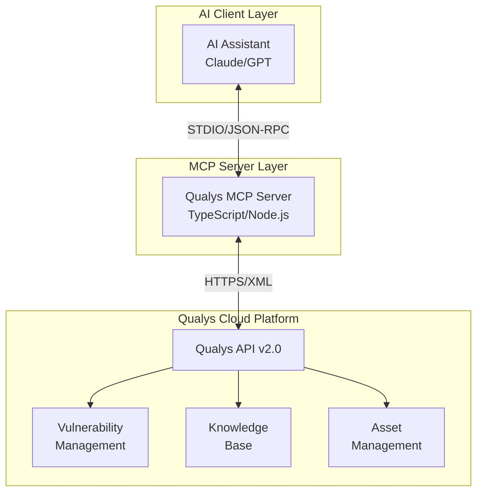

# Qualys MCP Server - Architecture Documentation

This directory contains comprehensive architecture documentation for the Qualys MCP (Model Context Protocol) Server, which provides AI-powered integration with the Qualys Vulnerability Management platform.

## Document Index

| Document | Description |
|----------|-------------|
| [context.md](./context.md) | System Context Diagram (C4 Level 1) - High-level view of the system and its interactions |
| [containers.md](./containers.md) | Container Diagram (C4 Level 2) - Major runtime containers and their responsibilities |
| [components.md](./components.md) | Component Diagram (C4 Level 3) - Internal component structure of the MCP server |
| [deployment.md](./deployment.md) | Deployment Architecture - Environment configurations and infrastructure |
| [data-flows.md](./data-flows.md) | Data Flow Diagrams - Information flows and trust boundaries |
| [security.md](./security.md) | Security Architecture - Threat model, controls, and hardening measures |
| [togaf-mapping.md](./togaf-mapping.md) | TOGAF Alignment - Enterprise architecture views and mappings |
| [decisions.md](./decisions.md) | Architecture Decision Records - Key design decisions and rationale |

## Quick Start

### Prerequisites
- Node.js 18+ (ES2022 support required)
- Qualys account with API access
- MCP-compatible AI client (e.g., Claude Desktop)

### Configuration
Set the following environment variables:
```bash
export QUALYS_API_URL="https://qualysapi.qualys.com"  # Your Qualys platform URL
export QUALYS_USERNAME="your_username"
export QUALYS_PASSWORD="your_password"
```

### Running
```bash
npm install
npm run build
npm start
```

## Architecture Overview



## Key Capabilities

The Qualys MCP Server exposes 17 tools for vulnerability management:

| Category | Tools |
|----------|-------|
| **Host Management** | `qualys_list_hosts`, `qualys_get_host_detections` |
| **Scanning** | `qualys_launch_scan`, `qualys_list_scans`, `qualys_get_scan_results`, `qualys_cancel_scan`, `qualys_pause_scan`, `qualys_resume_scan` |
| **Reporting** | `qualys_list_reports`, `qualys_launch_report`, `qualys_download_report` |
| **Asset Management** | `qualys_list_asset_groups`, `qualys_list_tags` |
| **Knowledge Base** | `qualys_get_knowledgebase` |
| **Infrastructure** | `qualys_list_scanners`, `qualys_list_option_profiles` |
| **Audit** | `qualys_get_activity_log` |

## Technology Stack

| Layer | Technology |
|-------|------------|
| Runtime | Node.js 18+ (ES2022) |
| Language | TypeScript 5.3+ |
| Protocol | Model Context Protocol (MCP) SDK 1.0 |
| Transport | STDIO with JSON-RPC |
| HTTP Client | Axios 1.6+ |
| XML Parsing | xml2js 0.6+ |

## Architecture Principles

1. **Stateless Operation** - No persistent state; each request is independent
2. **Rate Limiting** - Built-in 1-second delay between API calls
3. **Credential Isolation** - Credentials passed via environment variables only
4. **XML/JSON Translation** - Automatic conversion of Qualys XML to JSON
5. **Error Resilience** - Comprehensive error handling with meaningful messages

## Security Considerations

- Credentials are never logged or exposed in responses
- Basic authentication over HTTPS only
- 2-minute timeout on API requests
- Rate limiting to prevent API abuse
- Input validation on all tool parameters

## Document Updates

Last updated: 2025-01-16

For questions or updates, refer to the individual architecture documents linked above.

---

## Open Questions and Gaps

1. **OAuth Support** - Currently only Basic Auth is supported; OAuth 2.0 integration is not implemented
2. **Caching** - No response caching mechanism; all requests hit the Qualys API directly
3. **Retry Logic** - No automatic retry on transient failures
4. **Metrics/Telemetry** - No built-in observability instrumentation
5. **Multi-tenancy** - Single credential set; no support for multiple Qualys accounts
