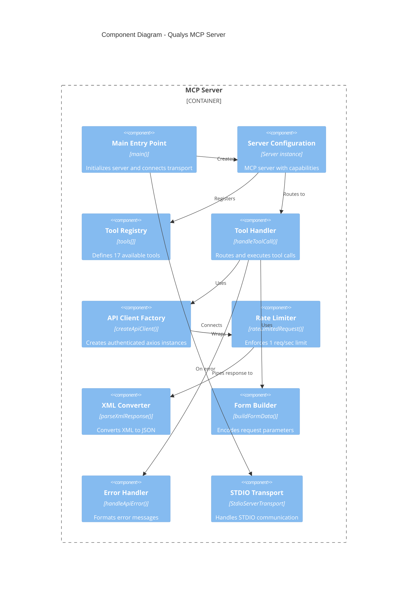
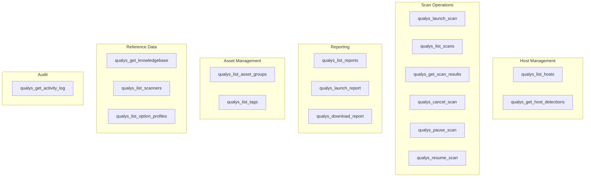
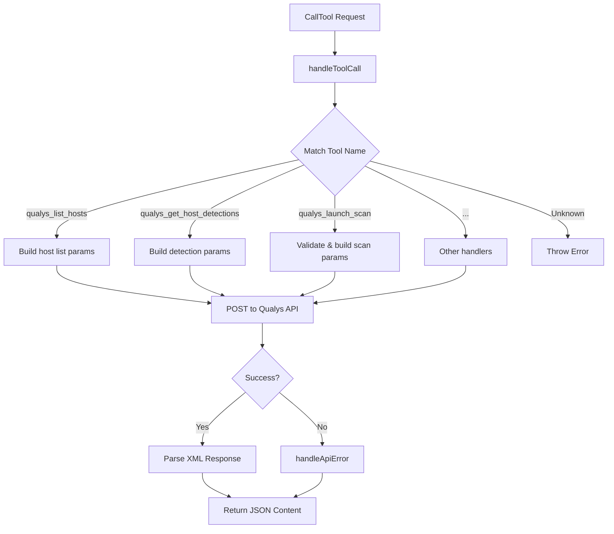
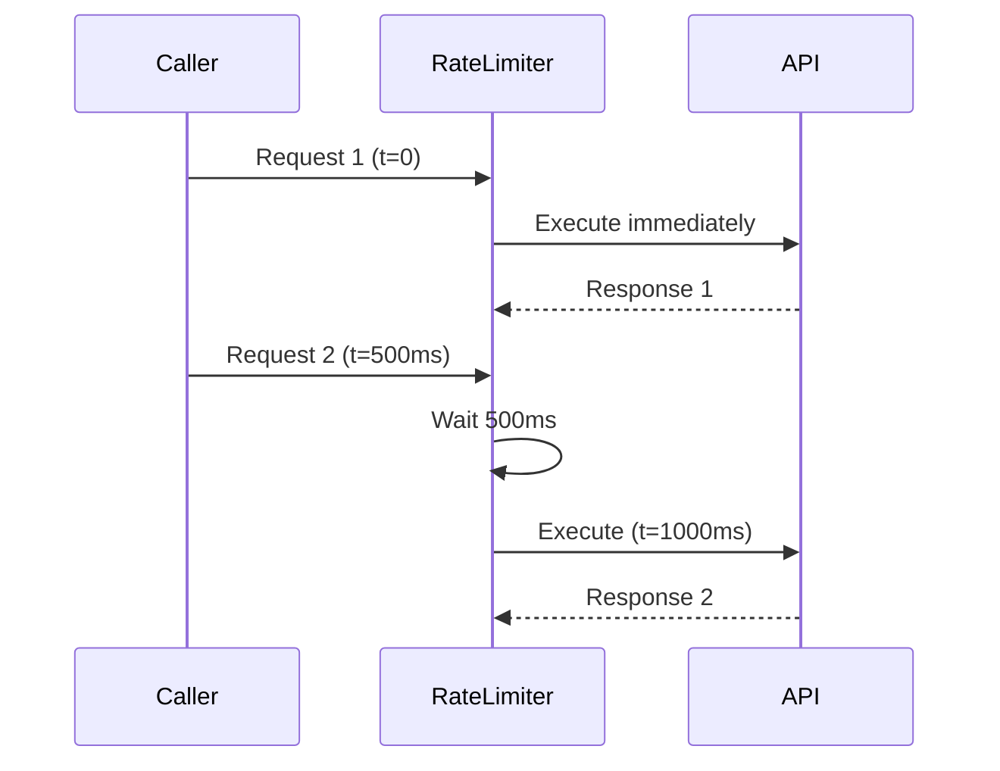
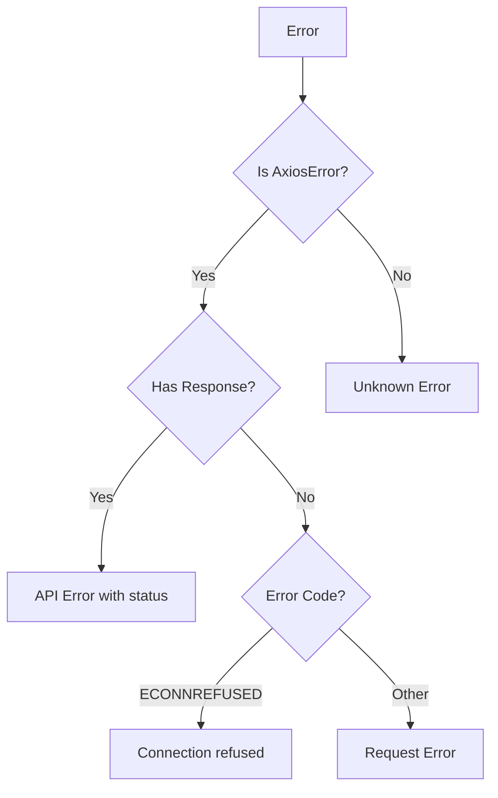

# Component Diagram - C4 Level 3

This document describes the internal component architecture of the Qualys MCP Server, showing how the codebase is organized and how components interact.

## Component Diagram



## Component Details

### Main Entry Point

**Location:** `src/index.ts` (lines 811-850)

```typescript
async function main(): Promise<void> {
  // Validate credentials
  // Create server instance
  // Register handlers
  // Connect transport
}
```

**Responsibilities:**
- Validate environment variables on startup
- Create and configure MCP server instance
- Register request handlers for ListTools and CallTool
- Connect to STDIO transport
- Log startup status to STDERR

### Server Configuration

**Location:** `src/index.ts` (lines 817-827)

```typescript
const server = new Server(
  { name: "qualys-mcp", version: "1.0.0" },
  { capabilities: { tools: {} } }
);
```

**Configuration:**

| Property | Value | Description |
|----------|-------|-------------|
| `name` | `qualys-mcp` | Server identifier |
| `version` | `1.0.0` | Server version |
| `capabilities.tools` | `{}` | Enables tool support |

### Tool Registry

**Location:** `src/index.ts` (lines 86-488)

The tool registry defines 17 tools organized into functional categories:



**Tool Schema Structure:**

```typescript
interface Tool {
  name: string;
  description: string;
  inputSchema: {
    type: "object";
    properties: Record<string, PropertySchema>;
    required?: string[];
  };
}
```

### Tool Handler

**Location:** `src/index.ts` (lines 490-808)



**Handler Patterns:**

| Tool Category | API Endpoint | HTTP Method | Validation |
|--------------|--------------|-------------|------------|
| Host operations | `/api/2.0/fo/asset/host/` | POST | Optional filters |
| Detection queries | `/api/2.0/fo/asset/host/vm/detection/` | POST | Optional filters |
| Scan operations | `/api/2.0/fo/scan/` | POST | `scan_title` required |
| Report operations | `/api/2.0/fo/report/` | POST | `template_id` required |
| Asset groups | `/api/2.0/fo/asset/group/` | POST | Optional filters |
| Knowledge Base | `/api/2.0/fo/knowledge_base/vuln/` | POST | Optional filters |
| Scanners | `/api/2.0/fo/appliance/` | POST | Optional filters |
| Option profiles | `/api/2.0/fo/subscription/option_profile/vm/` | POST | Optional filters |
| Tags | `/qps/rest/2.0/search/am/tag` | POST | Different endpoint |
| Activity log | `/api/2.0/fo/activity_log/` | POST | Optional filters |

### API Client Factory

**Location:** `src/index.ts` (lines 23-35)

```typescript
function createApiClient(): AxiosInstance {
  const auth = Buffer.from(`${QUALYS_USERNAME}:${QUALYS_PASSWORD}`).toString("base64");
  return axios.create({
    baseURL: QUALYS_API_URL,
    headers: {
      "Authorization": `Basic ${auth}`,
      "X-Requested-With": "qualys-mcp",
      "Content-Type": "application/x-www-form-urlencoded",
    },
    timeout: 120000,
  });
}
```

**Configuration Sources:**

| Variable | Environment Key | Default | Required |
|----------|----------------|---------|----------|
| API URL | `QUALYS_API_URL` | `https://qualysapi.qualys.com` | No |
| Username | `QUALYS_USERNAME` | `""` | Yes |
| Password | `QUALYS_PASSWORD` | `""` | Yes |

### Rate Limiter

**Location:** `src/index.ts` (lines 38-48)

```typescript
const RATE_LIMIT_DELAY_MS = 1000;
let lastRequestTime = 0;

async function rateLimitedRequest<T>(fn: () => Promise<T>): Promise<T> {
  const timeSinceLastRequest = Date.now() - lastRequestTime;
  if (timeSinceLastRequest < RATE_LIMIT_DELAY_MS) {
    await new Promise(resolve =>
      setTimeout(resolve, RATE_LIMIT_DELAY_MS - timeSinceLastRequest)
    );
  }
  lastRequestTime = Date.now();
  return fn();
}
```

**Behavior:**



### XML Converter

**Location:** `src/index.ts` (lines 51-61)

```typescript
async function parseXmlResponse(xml: string): Promise<unknown> {
  try {
    return await parseStringPromise(xml, {
      explicitArray: false,
      ignoreAttrs: false,
      mergeAttrs: true,
    });
  } catch (error) {
    return { raw: xml };
  }
}
```

**Parsing Options:**

| Option | Value | Effect |
|--------|-------|--------|
| `explicitArray` | `false` | Single elements are not wrapped in arrays |
| `ignoreAttrs` | `false` | XML attributes are preserved |
| `mergeAttrs` | `true` | Attributes merged into element object |

### Form Builder

**Location:** `src/index.ts` (lines 78-83)

```typescript
function buildFormData(params: Record<string, string | number | boolean | undefined>): string {
  return Object.entries(params)
    .filter(([_, value]) => value !== undefined && value !== "")
    .map(([key, value]) => `${encodeURIComponent(key)}=${encodeURIComponent(String(value))}`)
    .join("&");
}
```

**Input/Output Examples:**

| Input | Output |
|-------|--------|
| `{action: "list", ips: "10.0.0.1"}` | `action=list&ips=10.0.0.1` |
| `{action: "list", ips: undefined}` | `action=list` |
| `{ids: "1,2,3", status: "Active"}` | `ids=1%2C2%2C3&status=Active` |

### Error Handler

**Location:** `src/index.ts` (lines 64-75)

```typescript
function handleApiError(error: unknown): string {
  if (error instanceof AxiosError) {
    if (error.response) {
      return `API Error: ${error.response.status} - ${error.response.statusText}`;
    }
    if (error.code === "ECONNREFUSED") {
      return "Connection refused. Check your QUALYS_API_URL configuration.";
    }
    return `Request Error: ${error.message}`;
  }
  return `Unknown Error: ${String(error)}`;
}
```

**Error Categories:**



## Code Statistics

| Metric | Value |
|--------|-------|
| Total Lines | ~850 |
| Functions | 6 |
| Tool Definitions | 17 |
| Switch Cases | 17 |
| Dependencies | 3 |

## Dependency Graph

```mermaid
graph LR
    A[index.ts] --> B[@modelcontextprotocol/sdk]
    A --> C[axios]
    A --> D[xml2js]

    B --> B1[Server]
    B --> B2[StdioServerTransport]
    B --> B3[Types]

    C --> C1[AxiosInstance]
    C --> C2[AxiosError]

    D --> D1[parseStringPromise]
```

## Open Questions and Gaps

1. **Code Organization**: Single file (850 lines) - should this be split into modules?
2. **Type Safety**: Tool arguments use `unknown` - could use zod for runtime validation
3. **Testing**: No unit tests present - handlers are not easily testable in isolation
4. **Configuration**: No support for config files - only environment variables
5. **Extensibility**: Adding new tools requires modifying the main file
