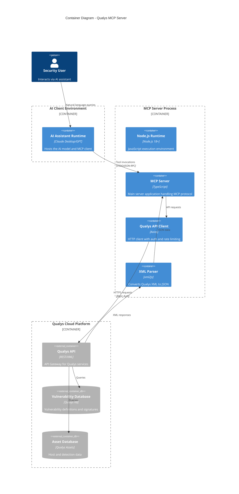
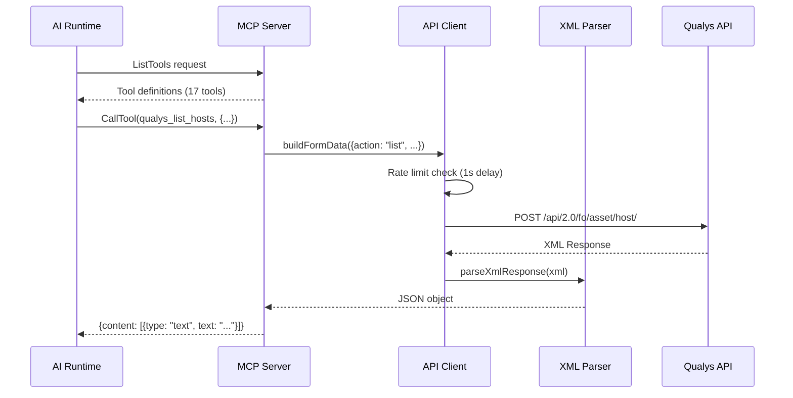
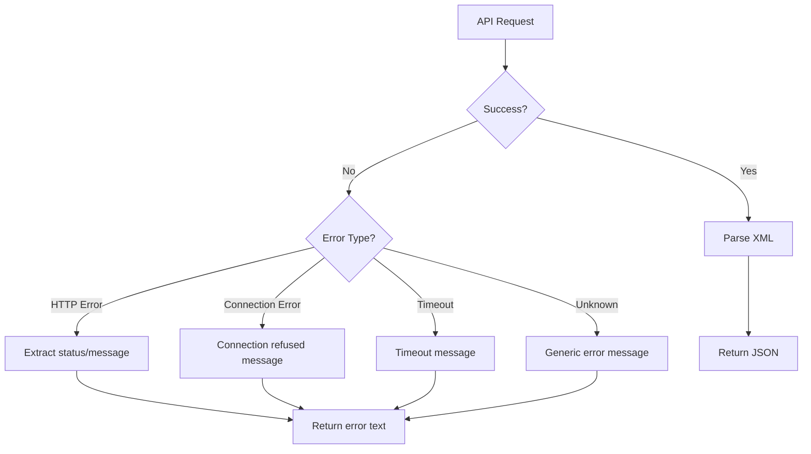
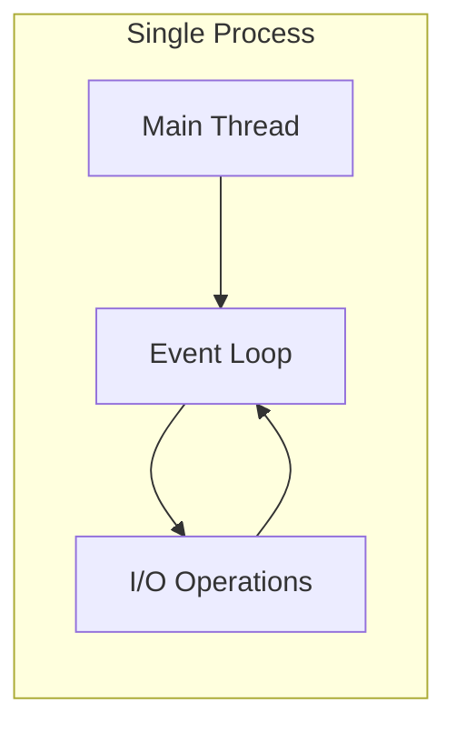

# Container Diagram - C4 Level 2

This document describes the container-level architecture of the Qualys MCP Server, showing the major runtime containers and their interactions.

## Container Diagram



## Container Descriptions

### Node.js Runtime

| Attribute | Value |
|-----------|-------|
| **Type** | Runtime Environment |
| **Technology** | Node.js 18+ (ES2022) |
| **Role** | Provides JavaScript execution environment |
| **Configuration** | ES Modules enabled, strict mode |

**Responsibilities:**
- Execute TypeScript-compiled JavaScript
- Manage process lifecycle
- Handle STDIO streams
- Provide async I/O capabilities

### MCP Server

| Attribute | Value |
|-----------|-------|
| **Type** | Application Container |
| **Technology** | TypeScript with MCP SDK |
| **Entry Point** | `dist/index.js` |
| **Protocol** | JSON-RPC 2.0 over STDIO |

**Responsibilities:**
- Implement MCP protocol handlers
- Register and describe available tools
- Route tool calls to appropriate handlers
- Format responses for AI consumption

**Key Dependencies:**
```json
{
  "@modelcontextprotocol/sdk": "^1.0.0"
}
```

### Qualys API Client

| Attribute | Value |
|-----------|-------|
| **Type** | Integration Component |
| **Technology** | Axios HTTP Client |
| **Base URL** | Configurable via `QUALYS_API_URL` |
| **Auth Method** | HTTP Basic Authentication |

**Responsibilities:**
- Construct authenticated HTTP requests
- Encode form data for POST requests
- Enforce rate limiting (1 req/sec)
- Handle connection timeouts (120s)

**Configuration:**
```typescript
{
  baseURL: QUALYS_API_URL,
  timeout: 120000,
  headers: {
    "Authorization": "Basic <base64>",
    "X-Requested-With": "qualys-mcp",
    "Content-Type": "application/x-www-form-urlencoded"
  }
}
```

### XML Parser

| Attribute | Value |
|-----------|-------|
| **Type** | Data Transformation Component |
| **Technology** | xml2js library |
| **Purpose** | Convert Qualys XML responses to JSON |

**Responsibilities:**
- Parse XML response bodies
- Flatten nested structures
- Merge XML attributes into objects
- Handle malformed XML gracefully

**Configuration:**
```typescript
{
  explicitArray: false,
  ignoreAttrs: false,
  mergeAttrs: true
}
```

## Container Interactions

### Request Flow



### Error Handling Flow



## Runtime Characteristics

### Memory Model

| Component | Estimated Memory | Notes |
|-----------|-----------------|-------|
| Node.js baseline | ~50 MB | V8 engine overhead |
| MCP SDK | ~10 MB | Protocol handling |
| Axios + dependencies | ~5 MB | HTTP client |
| xml2js | ~2 MB | Parser |
| **Total baseline** | **~70 MB** | Before processing data |

### Process Model



- **Single Process**: No worker threads or child processes
- **Event-Driven**: All I/O is non-blocking via Node.js event loop
- **No Clustering**: Designed for single-instance operation

### Communication Channels

| Channel | Direction | Protocol | Format |
|---------|-----------|----------|--------|
| STDIN | Input | JSON-RPC 2.0 | JSON |
| STDOUT | Output | JSON-RPC 2.0 | JSON |
| STDERR | Output | Text | Logs |
| Network | Bidirectional | HTTPS | XML/Form data |

## Scalability Considerations

### Current Limitations

1. **Single Instance**: No horizontal scaling support
2. **No Connection Pooling**: Each request creates new axios instance
3. **Memory-bound**: Large scan results held in memory
4. **Rate Limited**: 1 req/sec regardless of concurrency

### Potential Improvements

1. **Connection Reuse**: Use persistent axios instance
2. **Streaming**: Stream large XML responses instead of buffering
3. **Request Queuing**: Queue concurrent requests when rate limited
4. **Response Caching**: Cache static data (KnowledgeBase entries)

## Open Questions and Gaps

1. **Health Checks**: No built-in health monitoring or liveness probes
2. **Metrics**: No instrumentation for request latency or error rates
3. **Graceful Shutdown**: No signal handling for clean termination
4. **Connection Pooling**: Could axios connections be reused?
5. **Memory Limits**: What happens with very large scan results (10K+ hosts)?
