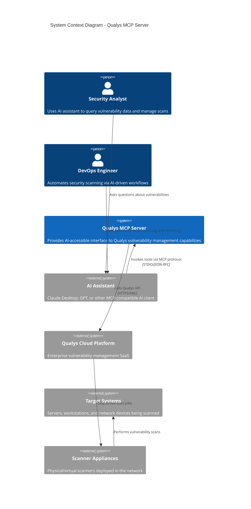
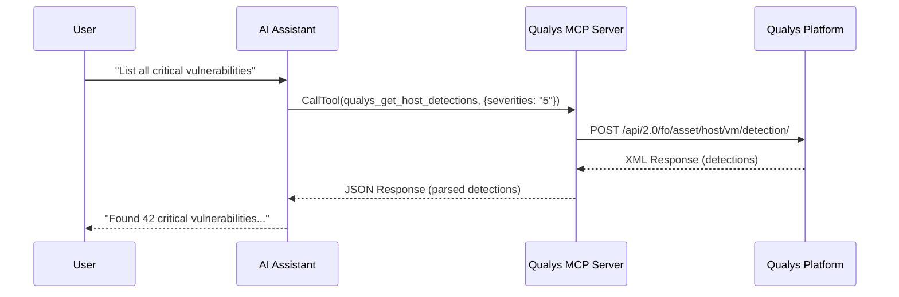
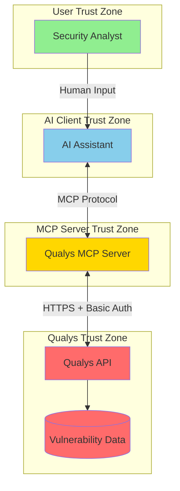

# System Context - C4 Level 1

This document describes the system context for the Qualys MCP Server, showing how it fits within the broader ecosystem of AI assistants and vulnerability management infrastructure.

## System Context Diagram

## Context Narrative

### Purpose
The Qualys MCP Server acts as a **bridge** between AI assistants and the Qualys vulnerability management platform. It translates natural language requests from users (via AI) into structured API calls to Qualys, and returns the results in a format that AI assistants can interpret and present.

### Actors

| Actor | Role | Interaction Pattern |
|-------|------|---------------------|
| **Security Analyst** | Primary user who queries vulnerability data | Asks AI questions like "Show me critical vulnerabilities on production servers" |
| **DevOps Engineer** | Automation-focused user | Requests operations like "Launch a scan on the web tier and notify me when complete" |
| **Compliance Officer** | Audit-focused stakeholder | Generates reports: "Create a compliance report for PCI hosts" |

### External Systems

| System | Type | Purpose | Protocol |
|--------|------|---------|----------|
| **AI Assistant** | MCP Client | Natural language interface for users | STDIO + JSON-RPC 2.0 |
| **Qualys Cloud Platform** | SaaS | Vulnerability management backend | HTTPS + REST/XML |
| **Scanner Appliances** | On-premise/Cloud | Execute vulnerability scans | Qualys internal protocols |
| **Target Systems** | IT Assets | Systems being assessed for vulnerabilities | Network protocols |

### Communication Patterns

## Trust Boundaries

### Trust Boundary Analysis

| Boundary | From | To | Security Control |
|----------|------|-----|------------------|
| **TB1** | User | AI | AI client authentication, conversation isolation |
| **TB2** | AI | MCP Server | STDIO isolation, process boundaries |
| **TB3** | MCP Server | Qualys API | HTTPS/TLS, Basic Authentication, Rate Limiting |

## Quality Attributes

### Availability
- **Dependency**: 100% dependent on Qualys platform availability
- **Graceful Degradation**: Returns meaningful errors when Qualys is unreachable
- **No State**: Stateless design means restart is instantaneous

### Performance
- **Latency**: Adds ~10ms overhead on top of Qualys API response time
- **Rate Limiting**: 1 request/second to Qualys API (configurable)
- **Timeout**: 2-minute timeout for long-running operations (scan results)

### Security
- **Credential Handling**: Environment variables only; never logged
- **Transport Security**: HTTPS required for Qualys communication
- **Input Validation**: Schema-based validation of all tool inputs

## Assumptions

1. **Qualys API Stability**: Assumes Qualys API v2.0 remains stable and backward-compatible
2. **Network Access**: MCP server has outbound HTTPS access to Qualys platform
3. **Credential Provisioning**: Environment variables are securely provisioned (not part of this system)
4. **AI Client Security**: The AI client properly isolates conversations and users

## Open Questions and Gaps

1. **Multi-region Support**: How should the server handle Qualys customers with assets in multiple regions?
2. **API Version Management**: What happens when Qualys deprecates API v2.0?
3. **Webhook Integration**: Should the server support Qualys webhooks for async scan completion?
4. **Session Management**: Is there value in maintaining persistent sessions with Qualys?
