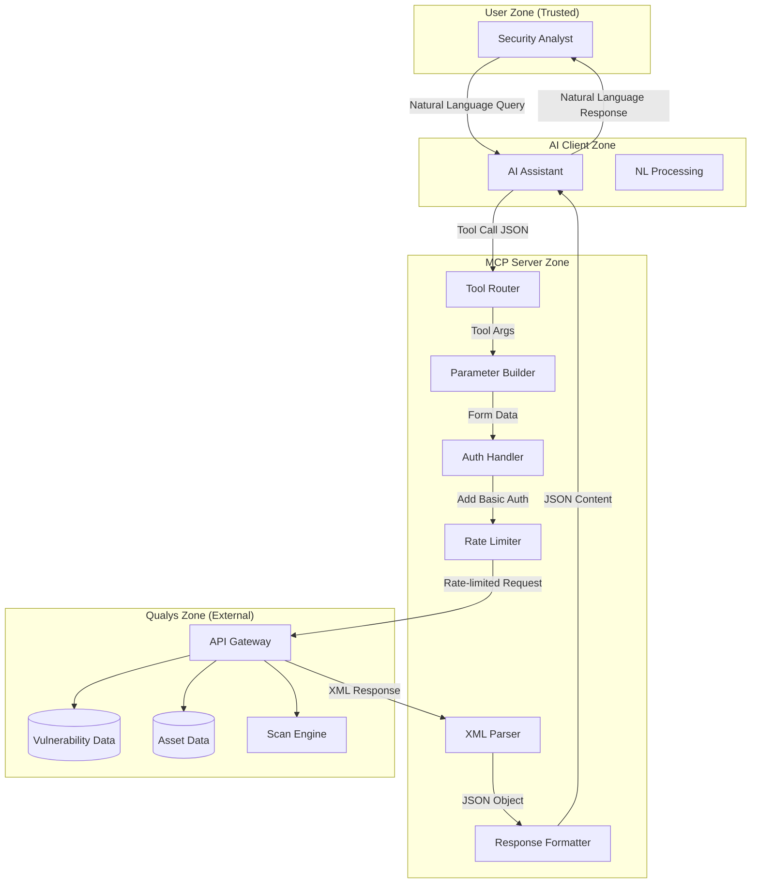
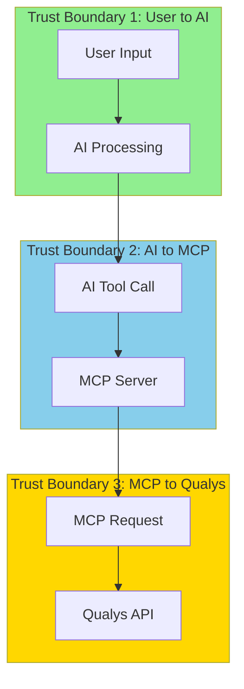
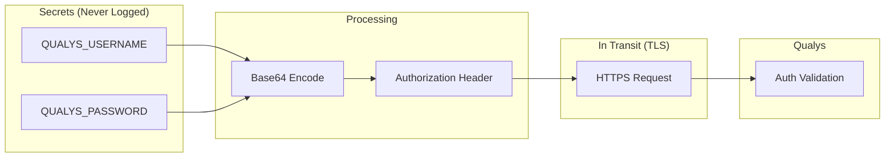
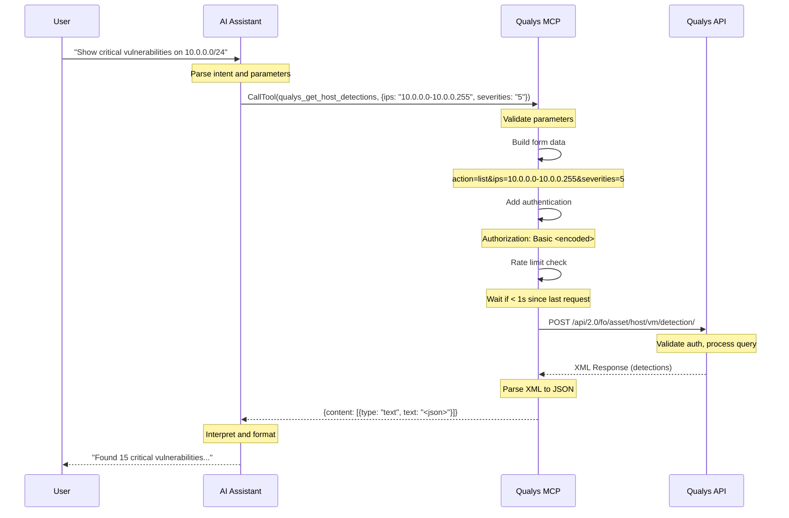
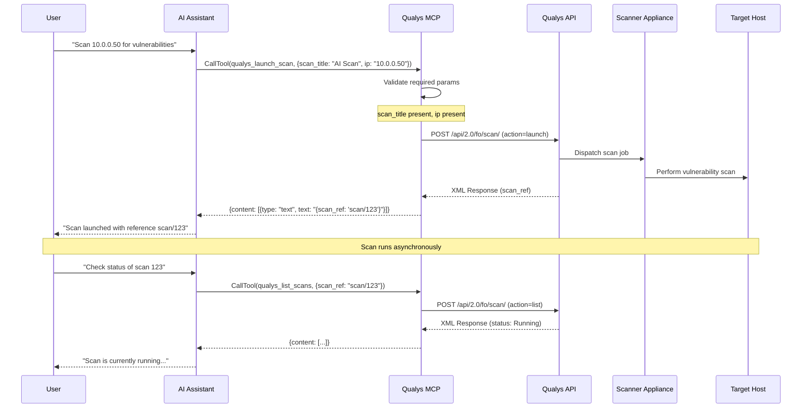
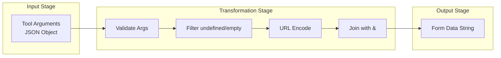
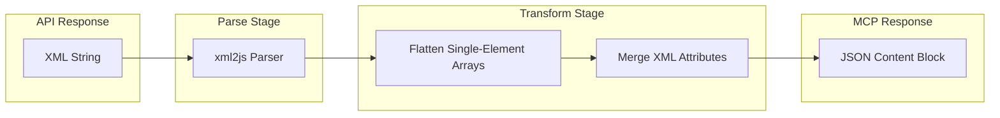
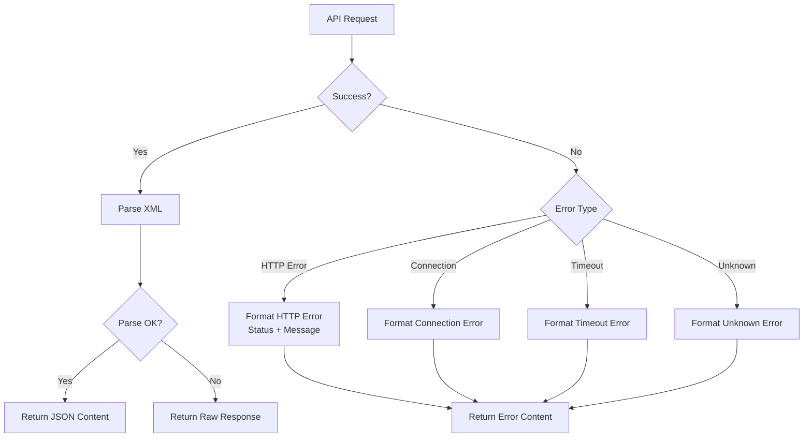

# Data Flow Diagrams

This document describes the data flows within the Qualys MCP Server, including trust boundaries, sensitive data paths, and data transformation stages.

## High-Level Data Flow Diagram



## Trust Boundaries



### Trust Boundary Analysis

| Boundary | From | To | Risks | Mitigations |
|----------|------|-----|-------|-------------|
| **TB1** | User | AI | Prompt injection, malicious queries | AI input sanitization |
| **TB2** | AI | MCP | Malformed tool calls, parameter injection | Schema validation |
| **TB3** | MCP | Qualys | Credential exposure, man-in-the-middle | TLS, Basic Auth |

## Sensitive Data Identification

### Data Classification

| Data Type | Classification | Location | Protection |
|-----------|---------------|----------|------------|
| Qualys Credentials | **SECRET** | Environment variables | Never logged, memory-only |
| Vulnerability Details | **CONFIDENTIAL** | API responses | TLS in transit |
| Host IP Addresses | **INTERNAL** | API requests/responses | TLS in transit |
| Scan Results | **CONFIDENTIAL** | API responses | TLS in transit |
| QID Information | **PUBLIC** | Knowledge Base | No special handling |

### Sensitive Data Flow



## Critical User Journey: Vulnerability Query



## Critical User Journey: Launch Scan



## Data Transformation Pipeline



### Example Transformation

**Input (Tool Arguments):**
```json
{
  "ips": "10.0.0.1,10.0.0.2",
  "severities": "4,5",
  "status": undefined,
  "truncation_limit": 100
}
```

**After Filtering:**
```json
{
  "action": "list",
  "ips": "10.0.0.1,10.0.0.2",
  "severities": "4,5",
  "truncation_limit": 100
}
```

**After URL Encoding:**
```
action=list&ips=10.0.0.1%2C10.0.0.2&severities=4%2C5&truncation_limit=100
```

## Response Transformation Pipeline



### Example XML to JSON

**Input (Qualys XML):**
```xml
<HOST_LIST_OUTPUT>
  <RESPONSE>
    <HOST_LIST>
      <HOST>
        <IP>10.0.0.1</IP>
        <ID>12345</ID>
        <TRACKING_METHOD>IP</TRACKING_METHOD>
      </HOST>
    </HOST_LIST>
  </RESPONSE>
</HOST_LIST_OUTPUT>
```

**Output (JSON):**
```json
{
  "HOST_LIST_OUTPUT": {
    "RESPONSE": {
      "HOST_LIST": {
        "HOST": {
          "IP": "10.0.0.1",
          "ID": "12345",
          "TRACKING_METHOD": "IP"
        }
      }
    }
  }
}
```

## Error Flow



## Data Retention

| Data Type | Retention in MCP | Retention in Qualys |
|-----------|------------------|---------------------|
| Request parameters | Request duration only | Per Qualys policy |
| Response data | Request duration only | Per Qualys policy |
| Credentials | Process lifetime | N/A |
| Error messages | Not persisted | Per Qualys policy |

## Open Questions and Gaps

1. **Credential Caching**: Should Basic Auth token be cached vs. regenerated per request?
2. **Response Size Limits**: What happens with very large responses (memory)?
3. **PII in Responses**: Should host IPs or other PII be redacted in logs?
4. **Audit Trail**: No local audit log of operations performed
5. **Data Masking**: No masking of sensitive fields in error messages
