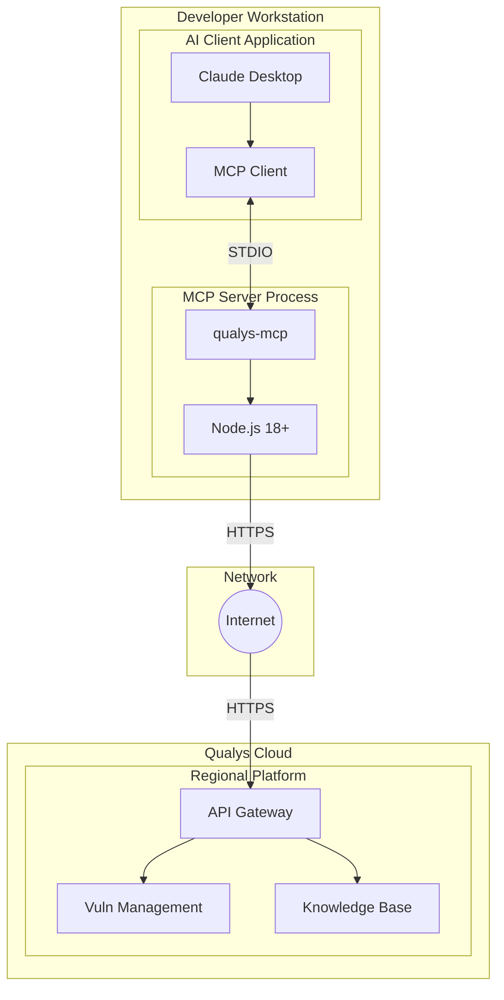
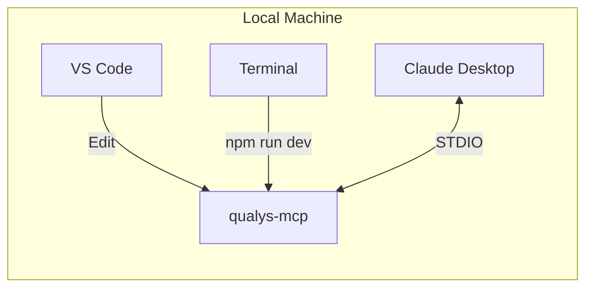
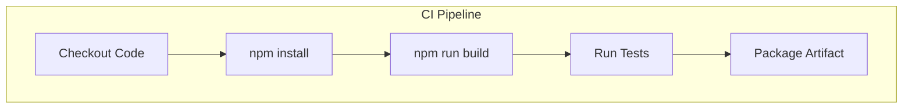
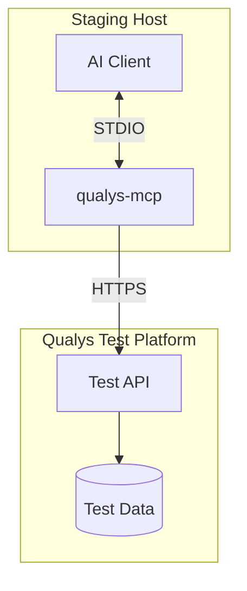
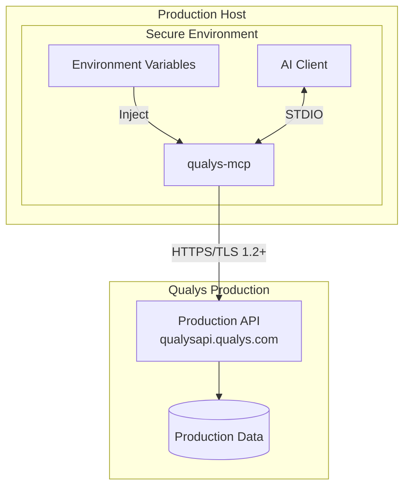
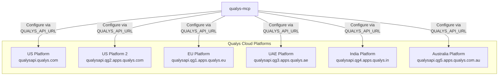

# Deployment Architecture

This document describes the deployment architecture for the Qualys MCP Server across different environments, including local development, CI/CD, and production scenarios.

## Deployment Diagram



## Environment Configurations

### Local Development



**Configuration:**

| Setting | Value |
|---------|-------|
| Node.js Version | 18+ (ES2022 support) |
| Build Command | `npm run build` |
| Start Command | `npm start` or `node dist/index.js` |
| Watch Mode | `npm run dev` (tsc --watch) |

**Environment Variables:**

```bash
# Local development .env (not committed)
export QUALYS_API_URL="https://qualysapi.qualys.com"
export QUALYS_USERNAME="dev_user"
export QUALYS_PASSWORD="dev_password"
```

**Claude Desktop Configuration (`~/.claude/claude_desktop_config.json`):**

```json
{
  "mcpServers": {
    "qualys": {
      "command": "node",
      "args": ["/path/to/qualys-mcp/dist/index.js"],
      "env": {
        "QUALYS_API_URL": "https://qualysapi.qualys.com",
        "QUALYS_USERNAME": "your_username",
        "QUALYS_PASSWORD": "your_password"
      }
    }
  }
}
```

### CI/CD Environment



**Pipeline Configuration (assumed):**

```yaml
# .github/workflows/build.yml (conceptual)
name: Build
on: [push, pull_request]
jobs:
  build:
    runs-on: ubuntu-latest
    steps:
      - uses: actions/checkout@v4
      - uses: actions/setup-node@v4
        with:
          node-version: '18'
      - run: npm ci
      - run: npm run build
      # No tests currently defined
```

**CI Environment Variables:**

| Variable | Source | Purpose |
|----------|--------|---------|
| `QUALYS_API_URL` | CI Secrets | Test environment URL |
| `QUALYS_USERNAME` | CI Secrets | Test account |
| `QUALYS_PASSWORD` | CI Secrets | Test account password |

### Staging Environment

**Deployment Pattern:** Identical to production but targeting Qualys test subscription.



**Staging Configuration:**

| Setting | Value |
|---------|-------|
| `QUALYS_API_URL` | Qualys test platform URL |
| Credentials | Test subscription credentials |
| Data | Synthetic test assets and vulnerabilities |

### Production Environment



**Production Configuration:**

| Setting | Value | Notes |
|---------|-------|-------|
| `QUALYS_API_URL` | `https://qualysapi.qualys.com` | Or regional platform |
| Credentials | Production service account | Minimum required permissions |
| TLS | 1.2 or higher | Enforced by Qualys |

## Qualys Platform Regions



## Network Requirements

### Outbound Connectivity

| Destination | Port | Protocol | Purpose |
|-------------|------|----------|---------|
| Qualys Platform | 443 | HTTPS | API calls |

### Firewall Rules

```
# Required outbound rule
ALLOW TCP OUTBOUND to *.qualys.com:443
ALLOW TCP OUTBOUND to *.qualys.eu:443
ALLOW TCP OUTBOUND to *.qualys.ae:443
ALLOW TCP OUTBOUND to *.qualys.in:443
ALLOW TCP OUTBOUND to *.qualys.com.au:443
```

## Resource Requirements

### Minimum Requirements

| Resource | Minimum | Recommended |
|----------|---------|-------------|
| CPU | 1 core | 2 cores |
| Memory | 256 MB | 512 MB |
| Disk | 50 MB | 100 MB |
| Node.js | 18.0.0 | 20.x LTS |

### Performance Characteristics

| Metric | Typical Value | Notes |
|--------|---------------|-------|
| Startup Time | < 1 second | Cold start |
| Memory (idle) | ~70 MB | No active requests |
| Memory (active) | ~100-200 MB | Depends on response size |
| API Latency | 100-5000ms | Depends on Qualys load |

## Installation Methods

### Method 1: Direct Node.js

```bash
# Clone and build
git clone <repository>
cd qualys-mcp
npm install
npm run build

# Configure environment
export QUALYS_API_URL="https://qualysapi.qualys.com"
export QUALYS_USERNAME="username"
export QUALYS_PASSWORD="password"

# Run
npm start
```

### Method 2: Claude Desktop Integration

1. Build the project: `npm run build`
2. Configure Claude Desktop:

```json
{
  "mcpServers": {
    "qualys": {
      "command": "node",
      "args": ["/absolute/path/to/qualys-mcp/dist/index.js"],
      "env": {
        "QUALYS_API_URL": "https://qualysapi.qualys.com",
        "QUALYS_USERNAME": "your_username",
        "QUALYS_PASSWORD": "your_password"
      }
    }
  }
}
```

3. Restart Claude Desktop

### Method 3: npx (if published)

```bash
# Hypothetical - not currently published
npx qualys-mcp
```

## Monitoring and Health

### Current State

The server currently has **no built-in monitoring capabilities**.

### Recommended Additions

1. **Startup Health Check:**
   - Validate credentials on startup
   - Test Qualys API connectivity

2. **Runtime Metrics:**
   - Request count
   - Error rate
   - Latency histogram

3. **Log Output:**
   - Currently only logs to STDERR
   - Add structured logging

### Log Output (Current)

```
# Startup
Qualys MCP server running on stdio

# Warnings (if credentials missing)
Warning: QUALYS_USERNAME and QUALYS_PASSWORD environment variables are required for API access.

# Fatal errors
Fatal error: <error details>
```

## Backup and Recovery

### What to Back Up

| Item | Location | Frequency |
|------|----------|-----------|
| Configuration | `.claude/claude_desktop_config.json` | On change |
| Credentials | Environment variables | Managed externally |

### Recovery Procedure

1. Reinstall Node.js 18+
2. Clone/restore codebase
3. Run `npm install && npm run build`
4. Restore configuration file
5. Restart AI client

## Open Questions and Gaps

1. **Containerization**: Should a Docker image be provided?
2. **Package Publishing**: Should this be published to npm?
3. **Auto-Updates**: How should updates be distributed?
4. **Credential Rotation**: How to handle password changes?
5. **High Availability**: Is HA needed for production use cases?
6. **Load Balancing**: Not applicable (single instance, STDIO-based)
