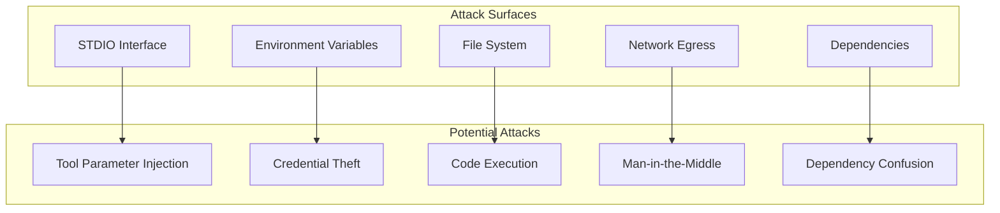
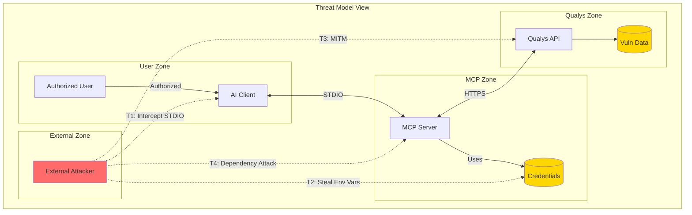
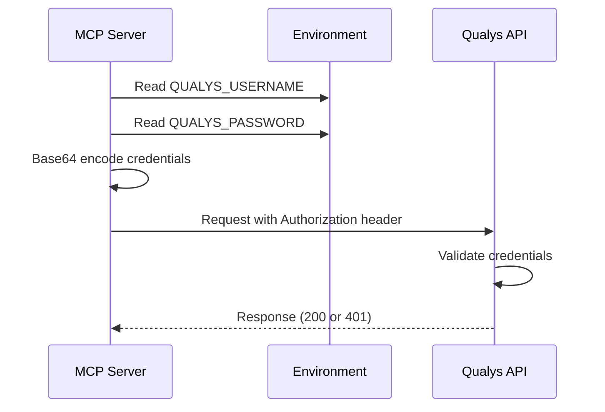
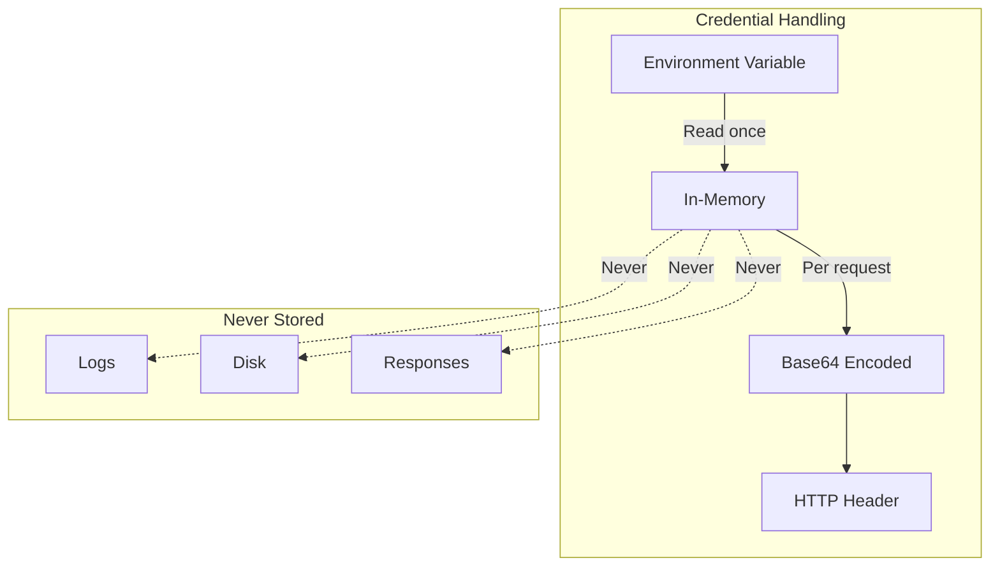

# Security Architecture

This document describes the security architecture of the Qualys MCP Server, including threat model, security controls, and hardening measures.

## Threat Model Summary

### Assets

| Asset | Value | Impact if Compromised |
|-------|-------|----------------------|
| **Qualys Credentials** | High | Full access to vulnerability data, ability to launch scans |
| **Vulnerability Data** | High | Reveals security weaknesses, aids attacker reconnaissance |
| **Host/Asset Information** | Medium | Reveals network topology and system inventory |
| **Scan Configuration** | Medium | Could enable disruptive or unauthorized scans |
| **Activity Logs** | Low | Reveals operational patterns |

### Threat Actors

| Actor | Motivation | Capability |
|-------|------------|------------|
| **External Attacker** | Steal vulnerability data | Network access, malware |
| **Malicious Insider** | Data exfiltration, sabotage | Direct access to systems |
| **Compromised AI Client** | Unauthorized operations | Valid MCP protocol access |
| **Supply Chain Attacker** | Persistent access | Compromised dependencies |

### Attack Surfaces



## Threat Model View



## STRIDE Threat Analysis

| Threat | Category | Description | Mitigation |
|--------|----------|-------------|------------|
| **T1** | Spoofing | Attacker impersonates AI client | Process isolation, no network listeners |
| **T2** | Tampering | Modify tool parameters in transit | STDIO is local, no network exposure |
| **T3** | Repudiation | Deny having performed scans | Qualys maintains activity logs |
| **T4** | Information Disclosure | Leak vulnerability data | TLS, credential protection |
| **T5** | Denial of Service | Exhaust rate limits | Rate limiting, input validation |
| **T6** | Elevation of Privilege | Gain Qualys admin access | Least privilege credentials |

## Security Controls

### Authentication and Authorization

#### Current Implementation

| Control | Status | Implementation |
|---------|--------|----------------|
| Qualys Authentication | Implemented | HTTP Basic Auth |
| MCP Client Authentication | None | Relies on process isolation |
| Tool Authorization | None | All tools available to all callers |

#### Authentication Flow



#### Recommendations

1. **Tool-Level Authorization**: Implement role-based tool access
2. **API Key Support**: Add support for Qualys API keys vs. passwords
3. **OAuth 2.0**: Implement OAuth for token-based authentication
4. **Credential Rotation**: Support for credential rotation without restart

### Data Protection

#### Encryption in Transit

| Path | Protocol | Minimum TLS | Certificate Validation |
|------|----------|-------------|----------------------|
| MCP to Qualys | HTTPS | TLS 1.2 | System trust store |

#### Encryption at Rest

| Data | At Rest Encryption | Notes |
|------|-------------------|-------|
| Credentials | No | Environment variables in memory |
| Response Data | No | Not persisted |
| Logs | No | Written to STDERR only |

#### Sensitive Data Handling



### Input Validation

#### Tool Parameter Validation

| Validation Type | Status | Implementation |
|-----------------|--------|----------------|
| Type checking | Partial | Runtime via MCP SDK |
| Required fields | Yes | Checked in handlers |
| Value ranges | No | Not implemented |
| Injection prevention | Partial | URL encoding only |

#### Example Validation

```typescript
case "qualys_launch_scan": {
  // Required field validation
  if (!args.scan_title) {
    throw new Error("scan_title is required");
  }
  if (!args.ip && !args.asset_groups && !args.asset_group_ids) {
    throw new Error("At least one of ip, asset_groups, or asset_group_ids is required");
  }
  // ...
}
```

#### Recommendations

1. **Zod Schemas**: Add runtime validation with Zod
2. **IP Address Validation**: Validate IP formats before sending
3. **SQL/XML Injection**: Though Qualys handles this, add client-side sanitization
4. **Length Limits**: Enforce maximum parameter lengths

### Rate Limiting

#### Current Implementation

```typescript
const RATE_LIMIT_DELAY_MS = 1000; // 1 second between requests
let lastRequestTime = 0;

async function rateLimitedRequest<T>(fn: () => Promise<T>): Promise<T> {
  const timeSinceLastRequest = Date.now() - lastRequestTime;
  if (timeSinceLastRequest < RATE_LIMIT_DELAY_MS) {
    await new Promise(resolve =>
      setTimeout(resolve, RATE_LIMIT_DELAY_MS - timeSinceLastRequest)
    );
  }
  lastRequestTime = Date.now();
  return fn();
}
```

#### Rate Limiting Behavior

| Scenario | Behavior |
|----------|----------|
| First request | Immediate |
| Second request (< 1s) | Delayed to 1s boundary |
| Qualys 429 response | No automatic retry |

#### Recommendations

1. **Adaptive Rate Limiting**: Respect Qualys rate limit headers
2. **Exponential Backoff**: Add retry with backoff for 429 responses
3. **Request Queuing**: Queue concurrent requests

### Network Security

#### Outbound Connections

| Destination | Port | Protocol | Purpose |
|-------------|------|----------|---------|
| `*.qualys.com` | 443 | HTTPS | API calls |
| `*.qualys.eu` | 443 | HTTPS | EU platform |

#### Network Security Controls

| Control | Status | Notes |
|---------|--------|-------|
| TLS Required | Yes | Axios default |
| Certificate Validation | Yes | System trust store |
| Certificate Pinning | No | Not implemented |
| Proxy Support | Partial | Via environment variables |

### Logging and Audit

#### Current Logging

```typescript
// Startup log
console.error("Qualys MCP server running on stdio");

// Warning log
console.error("Warning: QUALYS_USERNAME and QUALYS_PASSWORD environment variables are required");

// Error log
console.error("Fatal error:", error);
```

#### Audit Gaps

| Gap | Risk | Recommendation |
|-----|------|----------------|
| No request logging | No audit trail | Add structured request logging |
| No response logging | Cannot debug issues | Add response logging (redacted) |
| No user identification | Cannot attribute actions | Log user context if available |
| No centralized logging | Logs lost on restart | Integrate with log management |

### Dependency Security

#### Direct Dependencies

| Package | Version | Purpose | Security Notes |
|---------|---------|---------|----------------|
| `@modelcontextprotocol/sdk` | ^1.0.0 | MCP protocol | New, limited audit history |
| `axios` | ^1.6.0 | HTTP client | Well-maintained, regular security patches |
| `xml2js` | ^0.6.2 | XML parsing | Some historical CVEs, monitor updates |

#### Security Recommendations

1. **Dependency Audit**: Run `npm audit` regularly
2. **Lock File**: Commit `package-lock.json` to ensure reproducible builds
3. **Renovate/Dependabot**: Enable automated dependency updates
4. **SBOM**: Generate Software Bill of Materials

## Hardening Checklist

### Credential Hardening

- [ ] Use Qualys API keys instead of passwords (when supported)
- [ ] Implement credential rotation support
- [ ] Use secrets management (HashiCorp Vault, AWS Secrets Manager)
- [ ] Never log credentials (already implemented)

### Network Hardening

- [x] Require HTTPS for all external connections
- [ ] Implement certificate pinning for Qualys endpoints
- [ ] Configure proxy support with authentication
- [ ] Block unnecessary network access

### Application Hardening

- [x] Rate limit outbound API calls
- [ ] Implement request timeouts (done: 120s)
- [ ] Add circuit breaker pattern
- [ ] Implement input validation with Zod
- [ ] Add security headers to responses (N/A for STDIO)

### Runtime Hardening

- [ ] Run as non-root user
- [ ] Use read-only file system where possible
- [ ] Limit memory and CPU resources
- [ ] Enable Node.js security flags (`--disallow-code-generation-from-strings`)

### Monitoring and Detection

- [ ] Log all tool invocations
- [ ] Alert on authentication failures
- [ ] Monitor for unusual query patterns
- [ ] Integrate with SIEM

## Compliance Considerations

### SOC 2 Type II

| Control | Status | Notes |
|---------|--------|-------|
| Access Control | Partial | Environment-based credentials |
| Encryption | Yes | TLS for transit |
| Logging | Minimal | Needs enhancement |
| Monitoring | No | Not implemented |

### GDPR

| Consideration | Status | Notes |
|---------------|--------|-------|
| Data Minimization | N/A | Server is a passthrough |
| Data Processing | N/A | No data retained |
| Right to Erasure | N/A | No data stored |

## Security Incident Response

### Credential Compromise

1. **Immediate**: Rotate Qualys credentials in Qualys platform
2. **Investigation**: Review Qualys activity logs
3. **Recovery**: Update environment variables, restart MCP server
4. **Prevention**: Implement credential rotation automation

### Vulnerability Exploitation

1. **Immediate**: Stop MCP server
2. **Investigation**: Analyze attack vector
3. **Recovery**: Patch vulnerability, rebuild
4. **Prevention**: Enable automated dependency updates

## Open Questions and Gaps

1. **OAuth Support**: When will Qualys OAuth be supported for machine-to-machine?
2. **Audit Logging**: Should requests be logged locally or rely on Qualys audit?
3. **RBAC**: Should tool access be restricted based on user roles?
4. **Secrets Management**: Integration with enterprise secrets managers?
5. **Vulnerability Scanning**: Should we self-scan with Qualys during CI?
