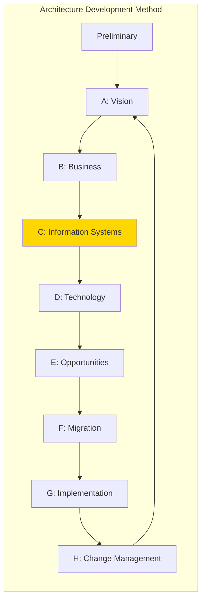
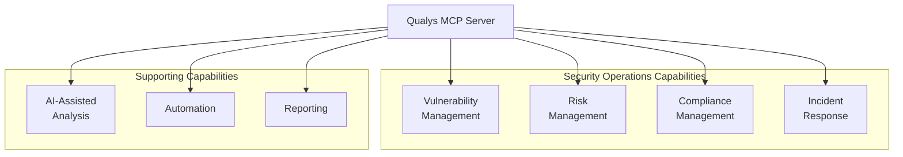
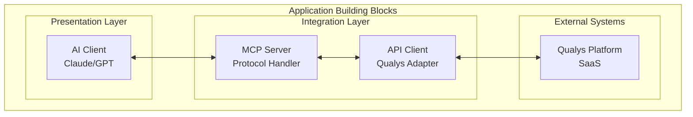
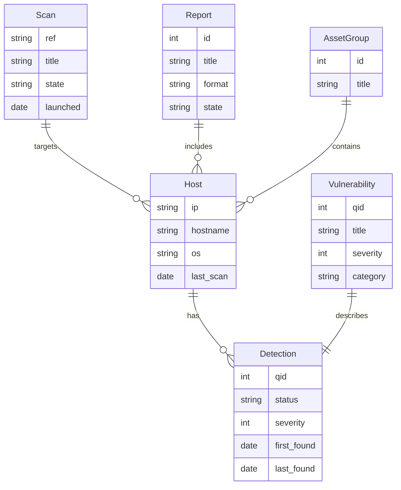
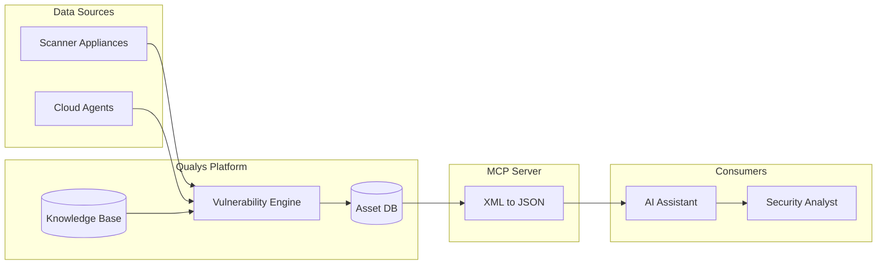
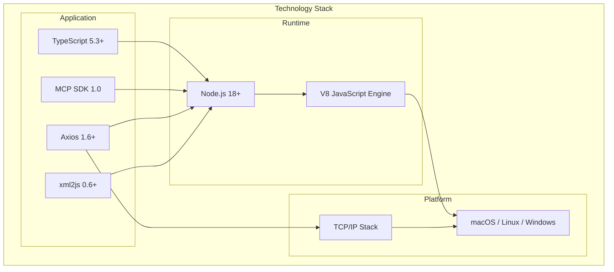
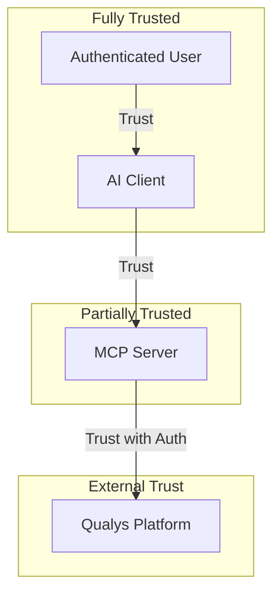

# TOGAF Architecture Mapping

This document provides a TOGAF-aligned view of the Qualys MCP Server architecture, mapping components to enterprise architecture domains.

## TOGAF ADM Phase Mapping



**Current Focus:** Phase D - Technology Architecture

The Qualys MCP Server is primarily a **technology building block** that enables AI-driven vulnerability management capabilities.

## Business Architecture

### Stakeholders

| Stakeholder | Role | Concerns |
|-------------|------|----------|
| **Security Operations** | Primary user | Efficient vulnerability queries, scan automation |
| **CISO/Security Leadership** | Sponsor | Risk visibility, compliance, efficiency |
| **DevOps/SRE** | Consumer | Automated security scanning in pipelines |
| **Compliance Team** | Consumer | Audit reporting, evidence collection |
| **IT Operations** | Infrastructure | Deployment, maintenance, monitoring |

### Business Drivers

| Driver | Description | Architecture Impact |
|--------|-------------|---------------------|
| **AI Adoption** | Leverage AI for security operations | MCP protocol integration |
| **Operational Efficiency** | Reduce manual vulnerability analysis | Natural language interface |
| **Automation** | Enable automated security workflows | Programmatic API access |
| **Visibility** | Real-time vulnerability posture | Live data from Qualys |

### Business Capabilities Enabled



### Constraints

| Constraint | Impact | Mitigation |
|------------|--------|------------|
| Qualys subscription required | Cost, dependency | Document pricing, ensure contract terms |
| API rate limits | Performance ceiling | Rate limiting, request optimization |
| Single platform support | No multi-vendor | Design for extensibility |
| Basic auth only | Security limitation | Request OAuth support from Qualys |

## Application Architecture

### Building Blocks



### Interfaces

| Interface | Type | Protocol | Format |
|-----------|------|----------|--------|
| MCP Protocol | Inbound | STDIO/JSON-RPC | JSON |
| Qualys API v2.0 | Outbound | HTTPS/REST | XML |
| Qualys QPS API | Outbound | HTTPS/REST | JSON |

### Service Contracts

#### Inbound Contract (MCP Tools)

```yaml
Service: qualys-mcp
Version: 1.0.0
Protocol: MCP (JSON-RPC 2.0 over STDIO)

Operations:
  - name: qualys_list_hosts
    type: query
    input: {ips?, ag_ids?, truncation_limit?}
    output: host_list_json

  - name: qualys_get_host_detections
    type: query
    input: {ips?, severities?, status?, qids?}
    output: detection_list_json

  - name: qualys_launch_scan
    type: command
    input: {scan_title, ip?, asset_groups?}
    output: scan_reference

  # ... 14 more tools
```

#### Outbound Contract (Qualys API)

```yaml
Service: Qualys API v2.0
Protocol: HTTPS
Authentication: Basic Auth

Endpoints:
  - path: /api/2.0/fo/asset/host/
    method: POST
    format: x-www-form-urlencoded

  - path: /api/2.0/fo/asset/host/vm/detection/
    method: POST
    format: x-www-form-urlencoded

  - path: /api/2.0/fo/scan/
    method: POST
    format: x-www-form-urlencoded

  # ... additional endpoints
```

## Data Architecture

### Entities



### Data Stores

| Store | Type | Owner | Access Pattern |
|-------|------|-------|----------------|
| Qualys Vulnerability DB | SaaS | Qualys | Read via API |
| Qualys Asset DB | SaaS | Qualys | Read/Write via API |
| Knowledge Base | SaaS | Qualys | Read via API |
| Activity Logs | SaaS | Qualys | Read via API |

### Data Lineage



### Data Classification

| Data Category | Classification | Handling |
|---------------|---------------|----------|
| Vulnerability detections | Confidential | Encrypt in transit |
| Host IP addresses | Internal | Encrypt in transit |
| QID information | Public | No restrictions |
| Credentials | Secret | Never log, memory only |
| Scan results | Confidential | Encrypt in transit |

### Retention

| Data | MCP Server Retention | Qualys Retention |
|------|---------------------|------------------|
| Request data | None (request scope) | Per subscription |
| Response data | None (request scope) | Per subscription |
| Credentials | Process lifetime | N/A |
| Logs | None (STDERR only) | Per subscription |

## Technology Architecture

### Runtime Stack



### Hosting

| Environment | Hosting Model | Notes |
|-------------|--------------|-------|
| Development | Local workstation | Runs alongside AI client |
| Production | Local workstation | Same as development |
| Container (future) | Docker/Podman | Not currently supported |
| Cloud (future) | N/A | STDIO prevents cloud hosting |

### Network Topology

```mermaid
graph TB
    subgraph "Local Environment"
        Workstation[Workstation]
        AIClient[AI Client Process]
        MCP[MCP Server Process]
    end

    subgraph "Internet"
        Firewall[Outbound Firewall]
        Internet((Internet))
    end

    subgraph "Qualys Cloud"
        QualysLB[Load Balancer]
        QualysAPI[API Servers]
    end

    AIClient <-->|STDIO| MCP
    MCP -->|HTTPS:443| Firewall
    Firewall --> Internet
    Internet --> QualysLB
    QualysLB --> QualysAPI
```

### Platform Services

| Service Category | Provider | Service |
|-----------------|----------|---------|
| Vulnerability Management | Qualys | VMDR / VM |
| Knowledge Base | Qualys | Built-in |
| Asset Management | Qualys | Built-in |
| Scanning | Qualys | Scanner Appliances |
| Reporting | Qualys | Built-in |

## Security Architecture

### Security Patterns

| Pattern | Application |
|---------|-------------|
| **Defense in Depth** | Multiple validation layers (MCP SDK, handler, Qualys) |
| **Least Privilege** | Use minimal Qualys permissions |
| **Fail Secure** | Deny on auth failure, timeout |
| **Rate Limiting** | 1 req/sec to prevent abuse |

### Security Controls Mapping

| TOGAF Control | Implementation |
|---------------|----------------|
| Authentication | HTTP Basic Auth to Qualys |
| Authorization | Qualys role-based access |
| Encryption | TLS 1.2+ for API calls |
| Input Validation | Schema validation, URL encoding |
| Audit | Qualys activity logs |
| Availability | Rate limiting, timeouts |

### Trust Model



## Architecture Dimensions

### Modularity and Boundaries

| Dimension | Current State | Rationale | Future Improvements |
|-----------|--------------|-----------|---------------------|
| Component separation | Single file | Simple project | Split into modules |
| API versioning | None | v1.0 only | Add version negotiation |
| Plugin architecture | None | Not needed yet | Consider for multi-platform |

### Scalability and Performance

| Dimension | Current State | Rationale | Future Improvements |
|-----------|--------------|-----------|---------------------|
| Horizontal scaling | Not supported | STDIO-based | N/A for current design |
| Caching | None | Real-time data needs | Add KB caching |
| Connection pooling | None | Low volume expected | Add if needed |

### Reliability and Availability

| Dimension | Current State | Rationale | Future Improvements |
|-----------|--------------|-----------|---------------------|
| Fault tolerance | Basic error handling | Simple design | Add retry logic |
| Health checks | None | Local process | Add startup validation |
| Recovery | Process restart | Simple design | Add state recovery |

### Maintainability and Operability

| Dimension | Current State | Rationale | Future Improvements |
|-----------|--------------|-----------|---------------------|
| Logging | Minimal (STDERR) | Simple design | Add structured logging |
| Monitoring | None | Local process | Add metrics export |
| Configuration | Env vars only | Simple deployment | Add config file support |

### Security and Privacy

| Dimension | Current State | Rationale | Future Improvements |
|-----------|--------------|-----------|---------------------|
| Authentication | Basic Auth | Qualys standard | Add OAuth when available |
| Authorization | None | Qualys handles it | Add local RBAC |
| Data protection | TLS in transit | Standard practice | Add local encryption option |

### Cost and Efficiency

| Dimension | Current State | Rationale | Future Improvements |
|-----------|--------------|-----------|---------------------|
| Resource usage | Low (~70MB) | Simple design | N/A |
| API efficiency | 1:1 call ratio | Simple design | Add request batching |
| License costs | Qualys subscription | Required | N/A |

### Observability

| Dimension | Current State | Rationale | Future Improvements |
|-----------|--------------|-----------|---------------------|
| Metrics | None | Not implemented | Add Prometheus metrics |
| Tracing | None | Not implemented | Add OpenTelemetry |
| Logging | Basic | STDERR only | Add structured logs |

### Compliance and Governance

| Dimension | Current State | Rationale | Future Improvements |
|-----------|--------------|-----------|---------------------|
| Audit logging | Qualys only | Delegated | Add local audit |
| Data handling | Passthrough | No storage | N/A |
| Compliance | SOC 2 partial | Basic controls | Enhance for full SOC 2 |

## Open Questions and Gaps

1. **Multi-Platform Support**: Should this pattern be extended to other vulnerability scanners?
2. **Enterprise Architecture Repository**: Should this be registered in an EA tool?
3. **Capability Mapping**: How does this fit into the broader security capability model?
4. **Technology Roadmap**: What is the evolution path for this building block?
5. **Standards Alignment**: Should we align with specific NIST or ISO controls?
